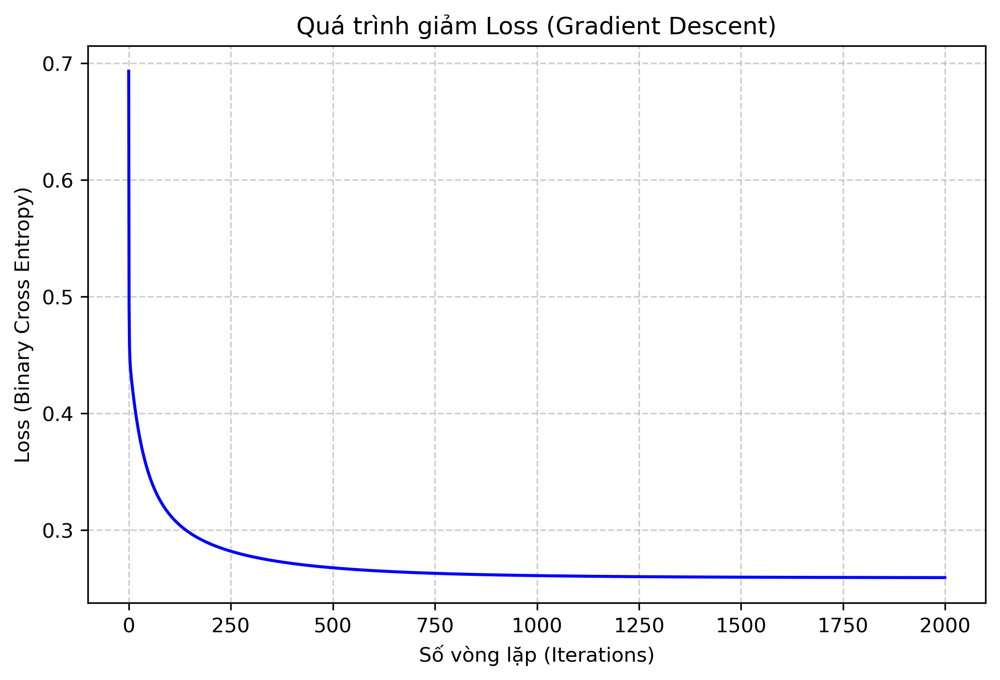
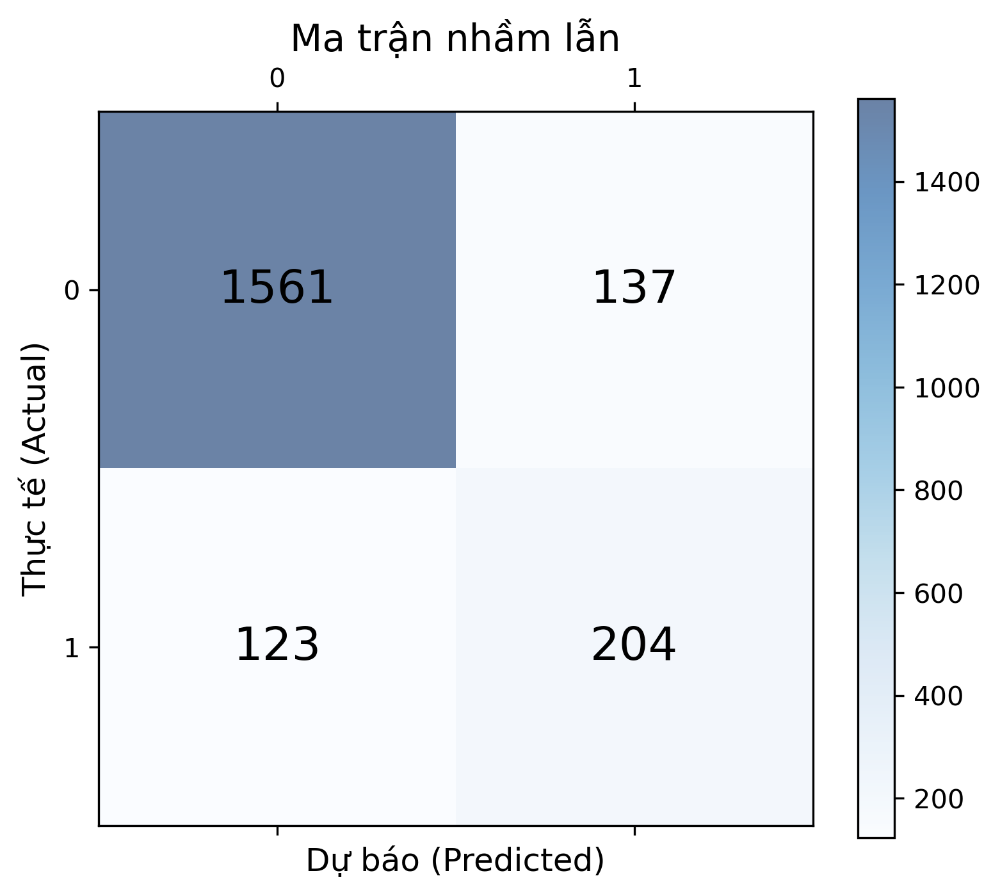

# Credit Card Customer Churn Prediction (Pure NumPy)

**Môn học:** Programming for Data Science  
**Bài tập:** NumPy for Data Science  

## Mục lục
1. [Giới thiệu](#-giới-thiệu)
2. [Bộ dữ liệu](#-bộ-dữ-liệu)
3. [Phương pháp và Kỹ thuật NumPy](#-phương-pháp-và-kỹ-thuật-numpy)
4. [Cài đặt](#-cài-đặt)
5. [Hướng dẫn sử dụng](#-hướng-dẫn-sử-dụng)
6. [Kết quả và Phân tích](#-kết-quả-và-phân-tích)
7. [Cấu trúc dự án](#-cấu-trúc-dự-án)
8. [Thách thức và Giải pháp](#-thách-thức-và-giải-pháp)
9. [Hướng phát triển](#-hướng-phát-triển)
10. [Tác giả](#-tác-giả)
11. [License](#-license)

---

## I. Giới thiệu

### 1. Bài toán
Trong lĩnh vực ngân hàng, việc giữ chân khách hàng (Customer Retention) quan trọng hơn việc tìm kiếm khách hàng mới. Dự án này nhằm mục đích dự đoán những khách hàng có nguy cơ rời bỏ dịch vụ thẻ tín dụng (**Customer Churn**).

### 2. Động lực thực hiện (Motivation)

#### a. Góc độ Kinh doanh
Trong lĩnh vực ngân hàng, chi phí để tìm kiếm một khách hàng mới thường cao gấp 5-25 lần so với việc giữ chân khách hàng cũ. Tuy nhiên, các phương pháp phân tích truyền thống (Descriptive Analytics) chỉ cho chúng ta biết *ai đã rời bỏ*.

Dự án này hướng tới **Phân tích Dự báo (Predictive Analytics)** với các mục tiêu cụ thể:
* **Hành động chủ động:** Thay vì phản ứng khi sự việc đã rồi, mô hình giúp nhận diện sớm các khách hàng có nguy cơ rời bỏ cao (High-risk) ngay từ bây giờ.
* **Tối ưu hóa nguồn lực:** Cung cấp danh sách khách hàng mục tiêu theo thời gian thực để nhân viên tư vấn tập trung chăm sóc, tặng ưu đãi hoặc thực hiện các chiến dịch giữ chân hiệu quả.
* **Chiến lược Bán chéo:** Từ phân tích dữ liệu, dự án xác định được "Độ sâu mối quan hệ" (Số lượng sản phẩm sử dụng) là yếu tố then chốt. Động lực không chỉ là giữ chân, mà còn là tìm ra cơ hội để bán thêm dịch vụ (Credit card + Savings + Insurance), giúp gia tăng sự gắn kết của khách hàng.

#### b. Góc độ Kỹ thuật
Khác với các dự án thông thường sử dụng Scikit-learn hay Pandas, dự án này đặt ra một thách thức kỹ thuật nghiêm ngặt: **Triển khai toàn bộ quy trình Data Science chỉ bằng thư viện NumPy**.

Mục tiêu của ràng buộc này là:
* **Hiểu sâu bản chất thuật toán:** Tự xây dựng class `LogisticRegression` từ con số 0, tự viết hàm tính Gradient Descent, hàm Loss (Cross-Entropy) giúp nắm vững toán học đằng sau các mô hình ML.
* **Tư duy tối ưu hóa (Optimization):** Rèn luyện kỹ năng Vectorization và quản lý bộ nhớ thông qua việc sử dụng các phép toán ma trận của NumPy thay vì vòng lặp, đảm bảo code chạy nhanh và hiệu quả như các thư viện chuẩn.

### 3. Mục tiêu
1. Xây dựng pipeline xử lý dữ liệu hoàn toàn bằng NumPy (Loading, Cleaning, Scaling).
2. Cài đặt thuật toán Logistic Regression từ con số 0 (from scratch).
3. Phân tích các yếu tố ảnh hưởng đến quyết định rời bỏ của khách hàng.

---

## II. Bộ dữ liệu

### 1. Nguồn dữ liệu
* **Tên:** Credit Card Customers (BankChurners).
* **Nguồn:** [Kaggle](https://www.kaggle.com/sakshigoyal7/credit-card-customers).

### 2. Mô tả các features
| Tên Cột | Kiểu Dữ Liệu | Ý Nghĩa & Mô Tả |
| :--- | :---: | :--- |
| **CLIENTNUM** | Integer | Mã định danh duy nhất của khách hàng. |
| **Attrition_Flag** | Categorical | Biến mục tiêu (Target). Trạng thái của khách hàng:<br>- `Existing Customer`: Khách hàng đang hoạt động.<br>- `Attrited Customer`: Khách hàng đã rời bỏ. |
| **Customer_Age** | Integer | Tuổi của khách hàng. |
| **Gender** | Categorical | Giới tính của khách hàng (M = Male, F = Female). |
| **Dependent_count** | Integer | Số lượng người phụ thuộc (con cái, người thân...). |
| **Education_Level** | Categorical | Trình độ học vấn (High School, Graduate, Uneducated, College,...). |
| **Marital_Status** | Categorical | Tình trạng hôn nhân (Married, Single, Divorced, Unknown). |
| **Income_Category** | Categorical | Nhóm thu nhập hàng năm. |
| **Card_Category** | Categorical | Loại thẻ tín dụng đang sử dụng (Blue, Silver, Gold, Platinum). |
| **Months_on_book** | Integer | Thời gian khách hàng đã gắn bó với ngân hàng (tính bằng tháng). |
| **Total_Relationship_Count** | Integer | Tổng số lượng sản phẩm/dịch vụ khách hàng đang sử dụng (thẻ, vay, tiết kiệm...). |
| **Months_Inactive_12_mon** | Integer | Số tháng không có hoạt động giao dịch trong 12 tháng qua. |
| **Contacts_Count_12_mon** | Integer | Số lần khách hàng liên hệ với ngân hàng trong 12 tháng qua. |
| **Credit_Limit** | Float | Hạn mức tín dụng tối đa của thẻ. |
| **Total_Revolving_Bal** | Float | Tổng dư nợ xoay vòng (số tiền chưa thanh toán hết và chuyển sang kỳ sau). |
| **Avg_Open_To_Buy** | Float | Hạn mức khả dụng trung bình (Credit Limit - Revolving Balance). |
| **Total_Amt_Chng_Q4_Q1** | Float | Tỷ lệ thay đổi số tiền giao dịch (Quý 4 so với Quý 1). |
| **Total_Trans_Amt** | Float | Tổng số tiền giao dịch trong 12 tháng qua. |
| **Total_Trans_Ct** | Integer | Tổng số lần giao dịch trong 12 tháng qua. |
| **Total_Ct_Chng_Q4_Q1** | Float | Tỷ lệ thay đổi số lần giao dịch (Quý 4 so với Quý 1). |
| **Avg_Utilization_Ratio** | Float | Tỷ lệ sử dụng thẻ trung bình (`Total_Revolving_Bal` / `Credit_Limit`). |
| **Naive_Bayes_...** | N/A | Các cột dư thừa từ bộ dữ liệu gốc (thường chứa kết quả của một mô hình khác), cần loại bỏ trước khi xử lý. |

### 3. Kích thước và Đặc điểm dữ liệu
* **Kích thước:** 10,127 dòng, 23 cột.
* **Đặc điểm:**
    * **Input Features:** Bao gồm thông tin nhân khẩu học (Tuổi, Giới tính, Education...) và hành vi giao dịch (Số lần giao dịch, Tổng tiền, Hạn mức tín dụng...).
    * **Target:** `Attrition_Flag` (1: Khách hàng rời bỏ, 0: Khách hàng hiện tại).
    * **Vấn đề:** Dữ liệu mất cân bằng (Imbalanced), tỷ lệ rời bỏ chỉ chiếm ~16%.

---

## III. Phương pháp và Kỹ thuật NumPy

Dự án áp dụng quy trình Data Science tiêu chuẩn nhưng được triển khai thủ công bằng NumPy:

### 1. Quy trình xử lý (Data Processing)
* **Data Loading:** Sử dụng `np.genfromtxt` kết hợp với xử lý chuỗi thủ công để parse file CSV thành ma trận 2D.
* **Cleaning:**
    * Loại bỏ các cột nhiễu (`CLIENTNUM`, `Naive_Bayes_...`).
    * Xử lý Missing Values (nếu có).
* **Feature Engineering (Tạo đặc trưng mới):**
    * Tạo cột `Avg_Trans_Amt` (Giá trị trung bình mỗi giao dịch) = `Total_Trans_Amt` / `Total_Trans_Ct`.
* **Encoding:** Sử dụng `np.unique` để chuyển đổi các biến phân loại (Categorical) sang dạng số (Label Encoding & One-Hot Encoding).
* **Scaling:** Áp dụng **Robust Scaler** (sử dụng Median và IQR) để giảm tác động của outliers:
    $$X_{scaled} = \frac{X - Median}{IQR}$$

### 2. Thuật toán: Logistic Regression (From Scratch)
Mô hình được xây dựng thủ công trong class `LogisticRegressionNumPy`:
* **Hàm kích hoạt:** Sigmoid.
* **Hàm mất mát:** Binary Cross Entropy.
* **Tối ưu hóa:** Gradient Descent.

### 3. Kỹ thuật NumPy nâng cao
* **Vectorization:** Loại bỏ hoàn toàn vòng lặp `for` khi tính toán trên mảng lớn.
* **Einstein Summation (`np.einsum`):** Sử dụng để tính tích vô hướng (dot product) và Gradients hiệu quả, thay thế cho `np.dot` trong quá trình huấn luyện.
    * Code: `dw = (1/n) * np.einsum('ji,j->i', X.T, error)`

---

## IV. Cài đặt

1.  **Clone repository:**
    ```bash
    git clone https://github.com/NHanDuiGa/HW2---NUMPY-FOR-DATA-SCIENCE.git
    cd HW2---NUMPY-FOR-DATA-SCIENCE
    ```

2.  **Cài đặt thư viện:**
    ```bash
    pip install -r requirements.txt
    ```

---

## V. Hướng dẫn sử dụng

Chạy các notebook theo thứ tự sau trong thư mục `notebooks/`:

1.  **`01_data_exploration.ipynb`**:
    * Khám phá dữ liệu, kiểm tra phân phối.
    * Vẽ biểu đồ phân tích hành vi khách hàng và trả lời câu hỏi nghiên cứu.
2.  **`02_preprocessing.ipynb`**:
    * Thực hiện Feature Engineering.
    * Chuẩn hóa dữ liệu và Chia tập Train/Test (thủ công bằng `np.random.shuffle`).
3.  **`03_modeling.ipynb`**:
    * Huấn luyện mô hình Logistic Regression tự code.
    * Đánh giá kết quả (Accuracy, Recall, F1-Score).
    * Trực quan hóa Feature Importance.

---

## VI. Kết quả và Phân tích

Mô hình **Logistic Regression (NumPy Implementation)** được xây dựng và đánh giá dựa trên hai mục tiêu KPI chính: **Accuracy > 85%** và **Recall (Khả năng phát hiện khách hàng rời bỏ) > 70%**.

### 1. Hiệu năng mô hình (Model Performance)

Kết quả thực tế trên tập kiểm thử (Test Set) khi thiết lập **ngưỡng quyết định (Threshold) là 0.3**:

| Chỉ số | Kết quả thực tế | Yêu cầu KPI | Đánh giá |
| :--- | :--- | :--- | :--- |
| **Accuracy** | **87.16%** | $> 85\%$ | **ĐẠT** |
| **Recall** | **62.39%** | $> 70\%$ | **CHƯA ĐẠT** |

#### a. Phân tích nguyên nhân (Tại sao Recall thấp?)
Mặc dù Accuracy rất cao (**87.16%**), chỉ số Recall chưa đạt kỳ vọng (chỉ phát hiện được ~62% khách hàng rời bỏ). Nguyên nhân chính nằm ở sự **đánh đổi (Trade-off)** trong bài toán mất cân bằng dữ liệu:

* **Dữ liệu:** Tỷ lệ rời bỏ thực tế chỉ chiếm khoảng **16%**.
* **Hành vi mô hình:** Tại ngưỡng `0.3`, mô hình vẫn còn khá "thận trọng". Nó ưu tiên tối đa hóa độ chính xác tổng thể (Accuracy) nên có xu hướng dự đoán an toàn vào nhóm đa số (Khách hàng ở lại).
* **Hệ quả:** Điều này dẫn đến việc bỏ sót khoảng **38%** số lượng khách hàng có nguy cơ rời bỏ thực sự (False Negatives - Âm tính giả).



#### b. Giải pháp đề xuất (Threshold Tuning)
Để nâng cao chỉ số Recall lên trên 70% nhằm bắt kịp KPI, chiến lược tối ưu hóa tiếp theo là:

* **Hành động:** Tiếp tục hạ ngưỡng quyết định từ mức hiện tại ($0.3$) xuống mức thấp hơn (ví dụ $\approx 0.2$).
* **Kỳ vọng:** Khi hạ ngưỡng, mô hình sẽ chấp nhận rủi ro dự báo sai nhiều hơn (Accuracy có thể giảm nhẹ về mức ~85%) để đổi lấy khả năng "quét" được nhiều khách hàng rời bỏ hơn (tăng Recall).



---

### 2. Insights từ Dữ liệu và Mô hình

#### a. Yếu tố quan trọng nhất (Feature Importance)
Phân tích trọng số (Weights) từ mô hình Logistic Regression giúp xác định các động lực chính thúc đẩy hoặc ngăn chặn hành vi rời bỏ:


1.  **`Total_Trans_Ct` (Tổng số giao dịch):**
    * **Trọng số Âm lớn nhất.**
    * *Ý nghĩa:* Đây là "tín hiệu sống còn". Khách hàng giao dịch càng ít, nguy cơ rời bỏ càng cao.
2.  **`Total_Relationship_Count` (Số lượng sản phẩm):**
    * **Trọng số Âm.**
    * *Ý nghĩa:* Thể hiện sự gắn kết. Khách hàng sử dụng combo **từ 4 sản phẩm trở lên** rất hiếm khi rời bỏ do chi phí chuyển đổi (Switching Cost) cao.
3.  **`Contacts_Count_12_mon` (Số lần liên hệ):**
    * **Trọng số Dương.**
    * *Ý nghĩa:* Tần suất liên hệ cao thường là dấu hiệu của sự phàn nàn hoặc vấn đề chưa được giải quyết, dẫn đến rủi ro rời bỏ gia tăng.

#### b. Kết luận Hành động (Actionable Insight)
Dựa trên kết quả định lượng từ mô hình, ngân hàng nên tập trung vào các chiến lược sau:

* **Chiến lược Bán chéo (Cross-selling):** Tập trung vào nhóm khách hàng đang sử dụng 1-2 dịch vụ, chào mời thêm các gói ưu đãi (Thẻ + Tiết kiệm + Bảo hiểm) để tăng `Total_Relationship_Count` lên mức an toàn ($\ge 3$).
* **Kích cầu giao dịch:** Tạo các chương trình khuyến mãi (cashback, điểm thưởng) cho nhóm khách hàng có tần suất giao dịch thấp (**< 40 lần/năm**) để giảm thiểu rủi ro nhận diện bởi `Total_Trans_Ct`.

---

## VII. Cấu trúc dự án

`````
project-name/
├── data/
│ ├── raw/ # Dữ liệu gốc (BankChurners.csv)
│ └── processed/ # Dữ liệu dạng .npy sau khi xử lý
├── notebooks/
│ ├── 01_data_exploration.ipynb
│ ├── 02_preprocessing.ipynb
│ └── 03_modeling.ipynb
├── src/
│ ├── __init__.py
│ ├── data_processing.py # Hàm load, encoding, scaling, cleaning 
│ ├── models.py # Class LogisticRegressionNumPy
│ └── visualization.py # Các hàm vẽ biểu đồ
├── README.md
└── requirements.txt
`````

---

## VIII. Thách thức và Giải pháp

Việc xây dựng một quy trình Data Science hoàn chỉnh chỉ với **Pure NumPy** (không Pandas, không Scikit-learn) đặt ra nhiều thách thức lớn về mặt thao tác dữ liệu và tối ưu thuật toán. Dưới đây là các vấn đề kỹ thuật chính và giải pháp đã triển khai:

| Lĩnh vực | Thách thức | Giải pháp Kỹ thuật |
| :--- | :--- | :--- |
| **1. Đọc dữ liệu hỗn hợp** | `np.genfromtxt` không linh hoạt như `pd.read_csv`. Khi dữ liệu chứa cả số (float) và chữ (string), việc đọc chung một mảng thường dẫn đến lỗi định dạng hoặc mất dữ liệu. | **Chiến lược tách luồng (Two-pass Loading):**<br>1. Đọc toàn bộ file dưới dạng `dtype=str` để đảm bảo không lỗi.<br>2. Tách header riêng.<br>3. Xây dựng dictionary ánh xạ thủ công để convert các cột Categorical sang dạng số (Encoding) ngay trong quá trình xử lý mảng. |
| **2. One-Hot Encoding** | Không có hàm `pd.get_dummies()`. Việc chuyển đổi biến phân loại (như *Marital_Status*) sang vector nhị phân rất phức tạp với mảng nhiều chiều. | **Vector hóa thủ công:**<br>Sử dụng `np.unique` để tìm các giá trị duy nhất, sau đó dùng Broadcasting `(data[:, None] == unique_values)` để tạo ma trận True/False và ép kiểu sang `int` hoặc `float` để có ma trận One-Hot. |
| **3. Hiệu năng tính toán** | Sử dụng vòng lặp `for` trong Python để nhân ma trận hoặc cập nhật trọng số Gradient Descent làm code chạy rất chậm trên tập dữ liệu lớn. | **Sử dụng `np.einsum` (Einstein Summation):**<br>Thay thế các phép nhân ma trận thông thường bằng `np.einsum('ij,j->i', X, w)`. Điều này không chỉ giúp code gọn hơn mà còn tối ưu hóa bộ nhớ đệm (cache locality) và tốc độ tính toán của CPU. |
| **4. Mất cân bằng dữ liệu** | Dữ liệu Churn chỉ chiếm 16%. Mô hình Logistic Regression tiêu chuẩn (với hàm Loss mặc định) luôn dự đoán thiên lệch về nhóm đa số (Accuracy cao nhưng Recall thấp). | **Custom Weighted Loss:**<br>Can thiệp trực tiếp vào toán học của thuật toán.<br>1. Tính tỷ lệ mất cân bằng (`pos_weight`).<br>2. Sửa công thức Gradient Descent: Nhân thêm trọng số vào sai số (`error * weight`) để "phạt" nặng hơn khi mô hình dự đoán sai khách hàng rời bỏ. |
| **5. Chia Train/Test** | Không có `train_test_split`. Cần đảm bảo dữ liệu được xáo trộn ngẫu nhiên nhưng vẫn tái lập được (Reproducible). | **Shuffle Indexing:**<br>Sử dụng `np.random.seed(42)` để cố định hạt giống ngẫu nhiên, sau đó tạo mảng index hoán vị (`np.random.permutation`) và dùng kỹ thuật Slicing mảng (`array[idx]`) để chia tập dữ liệu. |

---

### Điểm nhấn kỹ thuật: Sử dụng `np.einsum`
Trong dự án này, thay vì dùng `np.dot` đơn thuần, tôi ưu tiên sử dụng `np.einsum` để kiểm soát rõ ràng các chiều (dimensions) của phép nhân ma trận, giúp tránh các lỗi về shape broadcasting thường gặp trong NumPy.

---

## IX. Hướng phát triển (Future Work)

Để khắc phục các hạn chế hiện tại về độ nhạy (Recall) và mở rộng khả năng dự báo của mô hình, các hướng phát triển tiếp theo sẽ tập trung vào việc cài đặt các kỹ thuật nâng cao hoàn toàn bằng **NumPy**:

### 1. Xử lý Mất cân bằng dữ liệu nâng cao (SMOTE Implementation)
* **Vấn đề:** Hiện tại, mô hình sử dụng kỹ thuật *Class Weighting* (phạt lỗi) để cải thiện Recall. Tuy nhiên, với tập dữ liệu quá lệch, việc sinh thêm dữ liệu là phương pháp hiệu quả hơn.
* **Giải pháp cụ thể:** Cài đặt thuật toán **SMOTE (Synthetic Minority Over-sampling Technique)** từ con số 0:
    * Sử dụng `np.linalg.norm` để tính khoảng cách Euclid giữa các điểm dữ liệu thiểu số (Churn).
    * Dùng `np.argsort` để tìm k-láng giềng gần nhất (k-Nearest Neighbors).
    * Sinh điểm dữ liệu mới bằng công thức nội suy tuyến tính: $x_{new} = x_i + \lambda \times (x_{neighbor} - x_i)$ (với $\lambda$ là số ngẫu nhiên từ 0-1).

### 2. Mở rộng sang Mô hình Phi tuyến (Non-linear Models)
* **Vấn đề:** Logistic Regression bản chất là một bộ phân loại tuyến tính (Linear Classifier). Nếu ranh giới quyết định giữa khách hàng "Rời bỏ" và "Ở lại" là phi tuyến tính phức tạp, mô hình hiện tại sẽ bị giới hạn trần hiệu suất (Underfitting).
* **Giải pháp cụ thể:**
    * **Neural Network (MLP):** Mở rộng class hiện tại thành Mạng nơ-ron với 1 lớp ẩn (Hidden Layer). Việc này thực chất là thêm một phép nhân ma trận `np.dot` và hàm kích hoạt `ReLU` trước lớp Output.
    * **Random Forest:** Cài đặt thuật toán Decision Tree bằng cách sử dụng đệ quy và tiêu chuẩn Gini Index trên các mảng NumPy, sau đó kết hợp nhiều cây (Bagging) để tạo thành rừng ngẫu nhiên.

### 3. Đánh giá và Tối ưu hóa tham số (Optimization Pipeline)
* **Vấn đề:** Các tham số như `Learning Rate`, `Threshold`, `Iterations` đang được chọn dựa trên kinh nghiệm hoặc thử sai thủ công.
* **Giải pháp cụ thể:**
    * **K-Fold Cross-Validation:** Viết hàm chia mảng dữ liệu thành $K$ phần bằng nhau (dùng `np.array_split`), luân phiên dùng 1 phần làm Test, $K-1$ phần làm Train để đánh giá độ ổn định của mô hình.
    * **Grid Search từ đầu:** Xây dựng vòng lặp lồng nhau (Nested Loops) để tự động thử nghiệm hàng loạt tổ hợp tham số và lưu lại cấu hình cho kết quả F1-Score tốt nhất.

### 4. Bổ sung Regularization (L1/L2)
* **Mục tiêu:** Tránh hiện tượng Overfitting khi huấn luyện lâu.
* **Cài đặt:** Cộng thêm thành phần phạt (Penalty term) vào hàm Loss và cập nhật công thức Gradient:
    * $L2$: Thêm $\lambda \sum w^2$ vào Loss $\rightarrow$ Gradient cộng thêm $\lambda w$.
    * $L1$: Thêm $\lambda \sum |w|$ vào Loss $\rightarrow$ Gradient cộng thêm $\lambda \cdot \text{sign}(w)$.

---

## X. Tác giả
[Sakshi Goyal](https://www.kaggle.com/sakshigoyal7)
* Là kĩ sư phần mềm ở Wipro
* *Kinh nghiệm:* Chuyên gia về giải quyết các bài toán kinh doanh thông qua dữ liệu, cựu sinh viên PEC Chandigarh.

### Liên hệ (Contact)
* *GitHub:* [Link GitHub tác giả](https://github.com/Sakshi-16)
www.kaggle.com

---

## XI. License
[CC0: Publish Domain](https://creativecommons.org/publicdomain/zero/1.0/)